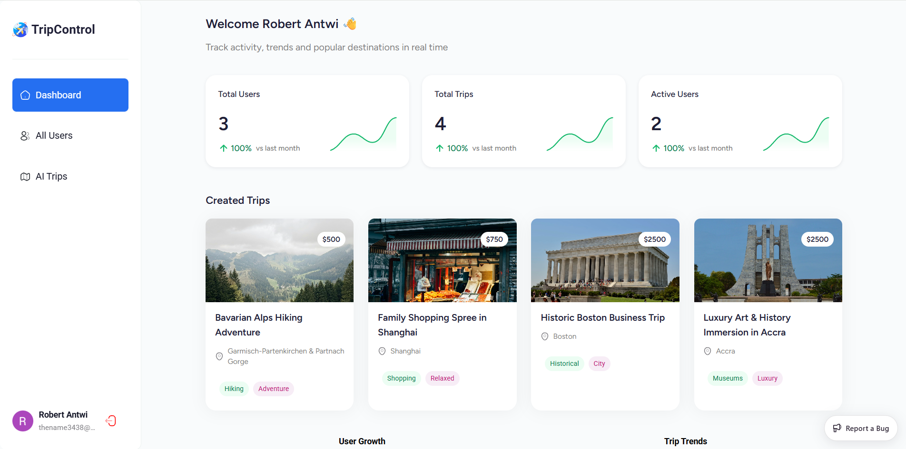

<a href="https://antwi-tripcontrol.vercel.app" target="_blank">
    
</a>

# TripControl – AI-Powered Travel Agency Platform

**TripControl** is a modern travel agency platform featuring an **AI-powered trip itinerary generator**, a **public booking website**, and a **robust admin dashboard**. Built with scalability, modularity, and a smooth user experience in mind, TripControl leverages cutting-edge technologies to make trip planning and management seamless for both users and admins.

---

## 🚀 Features

### AI & User Experience
- **AI-powered trip itinerary generator**: Personalized itineraries based on **country, travel style, interests, group type, and budget**.  
- **Responsive and modern design**: Smooth, mobile-first UI with a professional aesthetic.  
- **Trip booking functionality**: Browse and book trips directly on the public website.  

### Admin Dashboard
- **User management**: Track registered users and monitor growth metrics.  
- **Trip management**: Add, edit, or delete trips with detailed overviews.  
- **Interactive analytics**: Charts and tables showing user activity, trip trends, and insights.  
- **Secure authentication**: Admin-only access to sensitive features.

### Technical & Developer Features
- **Modular architecture**: Reusable React components for easy scalability.  
- **Modern frontend stack**: React 19, Tailwind CSS, Vite, and React Router v7.  
- **Backend integration**: Appwrite for authentication, database, and secure data management.  
- **Data visualization**: Interactive charts and tables using Syncfusion components.  
- **Smooth performance**: Optimized for fast load times and seamless navigation.  

---

## 🛠 Tech Stack

| Frontend | Backend | Styling & UI | Tools |
|----------|--------|--------------|-------|
| React 19 | Appwrite | Tailwind CSS | Vite |
| React Router v7 | Appwrite Database & Auth | Syncfusion | Git & GitHub |
|             | Appwrite Functions |                | Vercel (Deployment) |

---

## 📦 Getting Started

### Prerequisites
- Node.js >= 20
- npm or yarn
- Appwrite project with database and authentication configured

### Installation
```bash
# Clone the repository
git clone https://github.com/<your-username>/tripcontrol.git
# Navigate to the project folder
cd tripcontrol
```
```bash
# Install dependencies
npm install
# or
yarn install
```

```bash
VITE_SYNCFUSION_LICENSE_KEY=<your-syncfusion-license-key>
VITE_APPWRITE_API_ENDPOINT=<your-appwrite-endpoint>
VITE_APPWRITE_API_KEY=<your-appwrite-key>
VITE_APPWRITE_PROJECT_ID=<your-appwrite-project-id>
VITE_APPWRITE_DATABASE_ID=<your-database-id>
VITE_APPWRITE_USER_TABLE_ID=<your-user-table-id>
VITE_APPWRITE_TRIP_TABLE_ID=<your-trip-table-id>
GEMINI_API_KEY=<your-gemini-api-key>
UNSPLASH_ACCESS_KEY=<your-unsplash-access-key>
```

```bash
# Run the development server
npm run dev
# or
yarn dev
```

Open http://localhost:5173 in your browser to view the project.

<br />
🎨 UI & Components

Reusable components: Header, StatsCard, TripCard, Sidebar, Charts, Tables

Responsive layout: Mobile-first design that scales for desktop screens

Interactive charts: Column and SplineArea charts for user and trip analytics

Detailed trip pages: Overview, images, interests, travel styles, and pricing

<br />

🔒 Authentication & Security

Secure user login via Google OAuth using Appwrite

Role-based access control: Admins have full dashboard access; regular users see only public features

Persistent session management for seamless navigation

<br />

📊 Admin Dashboard

User growth metrics: Track daily, weekly, and monthly user activity

Trip analytics: Visualize trips by interest, travel style, and popularity

CRUD functionality: Create, update, delete trips and manage user data

Search & filtering: Quickly find users or trips using advanced filters

<br />

🌐 Live Demo

Check out the live deployment: 
[TripControl](https://antwi-tripcontrol.vercel.app)

<br />

```txt
📁 Project Structure
tripcontrol/
├─ routes/               # All page routes
│  ├─ root/              # Public site & sign-in
│  └─ admin/             # Admin dashboard pages
├─ components/           # Reusable React components
├─ appwrite/             # Auth and database helpers
├─ lib/                  # Utility functions
├─ constants/            # App constants like chart configs
└─ main.tsx              # Entry point
```

<br />

🤝 Contributing

Contributions are welcome! Please submit an issue or pull request.

<br />

🧑‍💻 Author

Robert Antwi
Creator of TripControl
[GitHub](https://github.com/antwirobert/) 
[LinkedIn](https://www.linkedin.com/in/robert-antwi-a0aab9277/)
